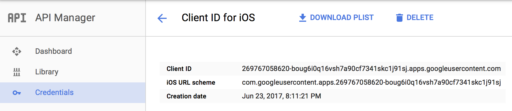
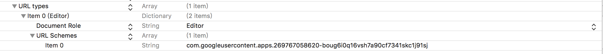

# MultiAccountOAuth

MultiAccountOAuth allows you to login to multiple Google OAuth accounts simultaneouly. 


While developing [PickedMail - The personal AI Inbox](https://itunes.apple.com/us/app/pickedmail/id1244830423?mt=8), we need to support user login to multiple Google accounts simultaneously. However, Google iOS SDK only allows user to sign in to one account at a time. As a result, we developed a framework to allow us to sign in and maintain connection status to multiple Google accounts. This framework is open sourced to help others who struggling through the same problem.

## Install
```ruby
pod 'MultiAccountOAuth'
```

## Requirements
* Swift 3.0+
* Xcode 8.0+
* iOS 9.0+, OSX 10.10+

## Usage

### Login to an Google Account

```swift
public func signin(controller: UIViewController, completion: ((_ success: Bool, _ user: GoogleUserInstance?, _ error: String?) -> ())?)
```

### Login to multiple Google accounts

```swift
public func signin(controller: UIViewController, completion: ((_ success: Bool, _ user: GoogleUserInstance?, _ error: String?) -> ())?)
```

### Get access to all of them 

```swift
public var authenticatedUsers = [GoogleUserInstance]()
```

### Next time when the user launches the app, sign in to all the Google accounts from background.

```swift
public func signinAllUsersSilently(completion: @escaping ()->() = {})
```


## Step by Step Setup Guide

### 1. Google Credential

* Create an iOS Applicaiton in Google API Console. Make sure you have the correct client id and URL scheme.



* Go to Info.plist in your iOS application, add the URL scheme to URL types.



### 2. AppDelegate.swift

Configure the google client id and URL scheme. You can optionally provide a server client id if you'd like to enable backend sever access.

```swift
import UIKit
import MultiAccountOAuth

@UIApplicationMain
class AppDelegate: UIResponder, UIApplicationDelegate {

    var window: UIWindow?

    func application(_ application: UIApplication, didFinishLaunchingWithOptions launchOptions: [UIApplicationLaunchOptionsKey: Any]?) -> Bool {

        OauthManager.sharedInstance.configure(cliendId: "269767058620-boug6i0q16vsh7a90cf7341skc1j91sj.apps.googleusercontent.com", scope: ["email"], urlScheme: "com.googleusercontent.apps.269767058620-boug6i0q16vsh7a90cf7341skc1j91sj", serverCliendId: nil)

        return true
    }

    func application(_ app: UIApplication, open url: URL, options: [UIApplicationOpenURLOptionsKey : Any] = [:]) -> Bool {
        if let oauthSession = OauthManager.sharedInstance.oauthSession {
            if oauthSession.resumeAuthorizationFlow(with: url) {
                OauthManager.sharedInstance.oauthSession = nil
                return true
            }
        }
        return false
    }
}

```

### The list of Google Scopes to choose from

* https://developers.google.com/identity/protocols/googlescopes

